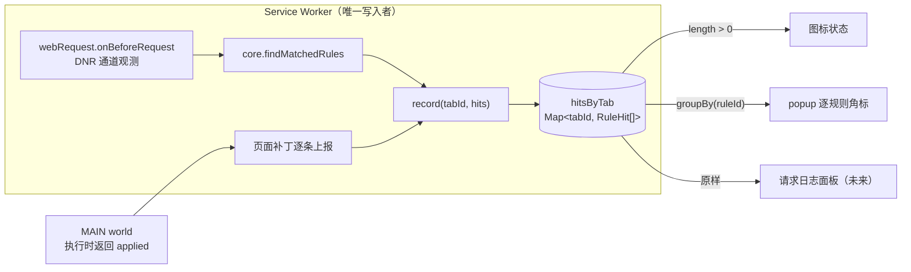

# 规则命中统计重构方案

把「规则命中统计」从「双计数器对账」重构为「单一命中日志 + 投影」。本文是动手前的完整依据，包含已拍板的决策、目标设计、模块拆分、迁移顺序与测试计划。

---

## 一、为什么要重构

现有实现（`utils/rule-match-counts.ts`、`utils/rule-match-state.ts`、`utils/dnr-rule-id.ts`、`utils/dnr-rule-registry.ts`）的复杂度绝大部分来自两个可以被消除的前提：

1. **把「计数」当成一等公民**。于是需要归并、扣除、求和、限幅、跨上下文校验，以及原生计数写入失败时的补偿回滚。
2. **`getMatchedRules` 是 pull API**。于是需要 `since` 统计窗口、`documentToken` 拒绝迟到消息、DNR 数字 ID ↔ 业务规则的持久化注册表、已删除规则的 tombstone、无法还原映射时的 `unmappedCount`。

此外还有两个结构性问题：

- **徽标是相对计数器，popup 总数是绝对重算**。清空时用绝对值去减相对计数器，要求二者语义完全一致；一旦不一致，徽标会产生**不会自愈的永久偏移**。
- **「哪些规则生效了」被算了两遍**。页面补丁通道先真正执行一遍，再由 `getAppliedRuleCounts` 重新推导一遍用于统计。两份逻辑必然漂移——passthrough Mock 场景下漏算改请求体动作，就是这个漂移的实例。

### `getMatchedRules` 的两条硬限制

| 限制 | 后果 |
|---|---|
| `MAX_GETMATCHEDRULES_CALLS_PER_INTERVAL = 20` / 10 分钟（仅用户手势豁免） | 每次开 popup 1 次、每次清空 1 次、重试按钮无退避，作为调试工具很容易打满 |
| 「非活动文档的命中，超过 5 分钟不再返回」 | 页面开久了逐规则计数会静默少算，且无法感知 |

这两条决定了它不适合作为持久计数的事实来源。

---

## 二、已拍板的决策

### 决策 1 · 徽标只标识状态，不显示数字

放弃 `declarativeNetRequest.setExtensionActionOptions` 的原生动作计数与 `tabUpdate.increment`。图标只表达「本页有没有规则生效」，对账问题从根源上消失。

### 决策 2 · DNR 侧事实来源改为 `chrome.webRequest` 观测

决策 1 要求图标**实时**变化，即需要 push 信号。候选逐一排除后只剩一个：

| 候选 | 结论 |
|---|---|
| `declarativeNetRequest.onRuleMatchedDebug` | 仅未打包扩展 + `declarativeNetRequestFeedback`，正式包不可用 |
| `declarativeNetRequest.getMatchedRules` | 只有 pull；轮询驱动图标会立刻打满配额 |
| 原生动作计数器 | Chrome 只维护、不可读回，导不出布尔状态 |
| **`chrome.webRequest`（观测式）** | **唯一可用的 push 信号** |

判定方式采用**预测**而非证据：在 Service Worker 中对每个请求调用 `core.findMatchedRules`。两条通道因此共用同一个匹配器（页面补丁通道已在使用它），不是新增第二套实现。

`onErrorOccurred(net::ERR_BLOCKED_BY_CLIENT)`、`onBeforeRedirect` 这类「DNR 确实动作了」的证据事件留作后续校正信号——它们覆盖不到 `ModifyHeaders`，且归因到具体规则仍然要跑匹配器，现阶段不值得引入第二条路径。

### 决策 3 · 移除 `webNavigation` 权限

安装时权限警告实测如下：

| 权限 | 安装警告 |
|---|---|
| `webRequest` | **无** |
| `webNavigation` | *读取您的浏览记录* |
| `declarativeNetRequestFeedback` | *读取您的浏览记录* |
| `declarativeNetRequest` | *屏蔽任何网页上的内容*（已有） |
| `tabGroups` | *查看和管理您的标签页组*（已有） |

`webRequest` 不增加任何新警告，且它所需的 host permissions（`<all_urls>`）本就已具备。改用 `webRequest.onBeforeRequest(type === 'main_frame')` 作为页面级状态的重置点后，`webNavigation` 可以整条移除，净减一条「读取您的浏览记录」警告。

---

## 三、目标设计

**一句话：只有一种事件，一个写入者，一份日志，三个投影。**



### 约定 1 · 没有「计数」，只有「命中事件」

```ts
/** 一次规则动作的执行记录，两条通道共用。 */
interface RuleHit {
  /** 业务规则 ID。 */
  ruleId: string;
  /** 实际执行的动作类型。 */
  action: RuleActionType;
  /** 请求 URL。 */
  url: string;
  /** 请求方法。 */
  method: string;
  /** 记录时间。 */
  at: number;
}
```

总数是 `log.length`，逐规则计数是 `groupBy(log, h => h.ruleId)`。`RuleMatchCount` 类型与 `rule-match-counts.ts` 整个文件不再存在。

这份日志同时也是 ROADMAP 中「P2 · 请求日志 / 命中高亮」的数据基础——现有的计数是它的有损压缩，压完就长不出日志了。

### 约定 2 · 一个写入者、一份状态

```ts
const hitsByTab = new Map<number, RuleHit[]>();

/**
 * 记录一批命中并刷新图标状态。
 * @param tabId 命中发生的标签页
 * @param hits 本次产生的命中事件
 */
function record(tabId: number, hits: RuleHit[]): void {
  const log = hitsByTab.get(tabId) ?? [];
  log.push(...hits);
  if (log.length > MAX_HITS) log.splice(0, log.length - MAX_HITS);
  hitsByTab.set(tabId, log);
  markIconActive(tabId);
}
```

图标不是被维护的第二份状态，而是日志的投影。没有外部计数器要对账，也就没有 increment、没有回滚补偿、没有清空时的边界时间戳。

### 约定 3 · 生效判定只做一次，在执行处产生

页面补丁侧，决定并执行动作的函数直接返回它实际应用了哪些规则。不存在第二个函数去重新推导——`getAppliedRuleCounts` 及其手写的 `appliesRequestBody` 条件从结构上不会出现。

### 约定 4 · 生命周期只有一个动作：清空

```ts
// 顶层导航开始 = 清空；同一事件里紧接着记录这次请求自己的命中
if (details.type === 'main_frame') ruleHitStore.clear(details.tabId);
```

重置点和第一条命中来自同一个事件，天然有序。不需要时间戳划分窗口，也不需要 `documentToken` 拒绝迟到消息——只要页面补丁改为逐条即时上报（去掉 100ms 批量窗口），迟到窗口就缩到消息队列的自然顺序内。批量是 `documentToken` 存在的唯一原因。

失效模式也更温和：导航中止时最坏是日志早清了一次，而不是计数器永久错位。

标签页关闭时 `delete`。生命周期到此为止。

### 存储分层与 Service Worker 生命周期

Service Worker 的两个性质对本设计影响相反，必须分开看：

- **同一时刻只有一个实例**。同一 profile 下扩展 SW 全局作用域只有一份，所有事件都在同一个单线程 event loop 中执行，不存在并发写。唯一例外是 `incognito: "split"`——本项目未声明该键，默认 `spanning`，不适用。
- **但它不是常驻的**。官方生命周期文档：空闲 **30 秒**后终止，「收到事件或调用扩展 API 会重置该计时器」；「你设置的任何全局变量都会在 Service Worker 关闭时丢失」。（5 分钟上限指单个事件/API 调用的处理时长，不是总寿命上限。）

因此存储分两层：**内存 Map 是权威存储，`storage.session` 是只写镜像**。由此推出四条设计约束：

**1. 记录路径必须全同步，串行写队列随之消失**

```ts
const log = hitsByTab.get(tabId) ?? [];
log.push(...hits);        // 中间没有 await
hitsByTab.set(tabId, log);
```

单线程 + 无 await = 天然原子。现有实现之所以需要按标签页的串行写队列，是因为它以 `storage.session` 为权威存储，每次记录都是异步的 read-modify-write，两个事件交错会互相覆盖。权威存储换位置后，这个队列不是要保留的优点，而是自然消失的东西。

**2. 规则必须有内存缓存**

上一条的前提是 `record()` 之前没有 await。而 webRequest 要对**每个请求**做匹配，若每次 `await getGroups()`，既慢又会把 await 引回记录路径。所以 SW 需维护一份生效规则缓存，由 `storage.onChanged` 刷新（Requestly 每个请求都 `await getEnabledRules()`，是它的性能短板）。

**3. 恢复时只填充内存中尚不存在的 tabId**

SW 重启后，「从镜像恢复」与「新请求触发 record」会竞争。若恢复写成整体赋值，会冲掉重启后已记录的命中：

```ts
for (const [tabId, log] of restored) {
  if (!hitsByTab.has(tabId)) hitsByTab.set(tabId, log);
}
```

一行，且永远正确。不需要 ready promise 门控，也不需要把 `record()` 变成异步。

**4. 镜像写入频率可以很低，且丢数据窗口接近零**

1 秒防抖足够，不必每条命中都落盘。常见的质疑是「防抖期内 SW 被终止怎么办」，这个担心不成立：SW 需空闲 **30 秒**才终止，而**记录一条命中本身就是收到事件，会重置该计时器**。能触发终止的前提是「最后一条命中之后又过了 30 秒无事件」，此时防抖早在第 1 秒就写完了——30 倍余量，空闲终止追不上防抖。

真正会丢的只有 SW 崩溃、浏览器被杀、扩展重载。前两种 session 权威也一样丢（`storage.session` 随浏览器关闭清空），只有扩展重载是内存权威独有的损失，而该场景下日志本无保留价值。

镜像本身仍是必需的（Requestly 只有内存 Map，没有镜像，SW 休眠即丢——这是它的实际缺陷）。

### 为什么不用 `storage.session` 作权威存储

现有实现正是 session 权威，且工作正常，所以这不是纠错而是权衡。`storage.session` 保存在内存中、不落盘，**单次读写很快**——理由不在延迟，在两点：

**每次写都要序列化整个数组。** `set({ [key]: log })` 需跨进程做结构化克隆，代价是 O(数组长度)。若每条命中写一次，一次页面加载累计 **O(n²)**：500 条命中约 12.5 万次对象序列化，1000 条（环形上限）约 50 万次。内存权威下同样 500 条命中只是 500 次 `push` 加几次全量写。

**这是写多读少的场景。** 读只发生在 popup 打开与 SW 冷启动两个时刻，中间几百次写没有任何人读。准确的说法是**重复做功**，不是 IPC 慢。

注意这同样是架构变化挪动了球门：现有实现 session 里存的是 `pagePatchRuleCounts`，长度受**规则条数**限制、不随请求量增长，O(n²) 从来不是问题；改存命中日志后数组长度随请求量线性增长。这与「写入频率从稀疏变为逐请求」是同一变化的两面。

> **未实测**。上述 O(n²) 是分析结论，没有基准数字。如需复核，可在未打包插件的 SW 控制台跑：
>
> ```js
> const log = Array.from({length: 500}, (_, i) => ({ ruleId: 'r', action: 'block', url: 'https://x/' + i, method: 'GET', at: Date.now() }));
> console.time('session');
> for (let i = 1; i <= 500; i++) await chrome.storage.session.set({ t: log.slice(0, i) });
> console.timeEnd('session');
> ```
>
> 若实测差距无关紧要，session 权威因「一份数据、无恢复逻辑」反而更简洁，应当改回。

该选择是**可逆的**：两种写法都封装在 `rule-hit-store.ts` 内部，外部只看到 `record` / `clear` / `read`，替换实现不影响其他模块。

---

## 四、模块拆分

### 新增

| 文件 | 职责 | 依赖浏览器 API |
|---|---|---|
| `utils/rule-hit.ts` | `RuleHit` 类型、`appendHits` / `countByRule` / `parseHits` / `mergeRestoredHits` | 否 |
| `utils/rule-hit-store.ts` | 内存 Map（权威）+ `storage.session` 防抖镜像 + 启动恢复 + `record` / `clear` / `read` | 是 |
| `utils/active-rules-cache.ts` | SW 内生效规则缓存，由 `storage.onChanged` 刷新，供逐请求匹配同步读取 | 是 |
| `utils/dnr-observer.ts` | webRequest 监听注册与注销、按需 gating；`toRuleHits(details, rules)` 纯函数单独导出 | 部分 |
| `utils/page-plan.ts` | 从候选规则解析本次请求的执行计划，**含 hits** | 否 |
| `utils/action-icon.ts` | 图标状态投影 | 是 |

`active-rules-cache.ts` 存在的唯一理由是保证 `record()` 路径上没有 await，见第三节存储分层第 2 条。

`page-plan.ts` 是拆分中最关键的一个。`entrypoints/interceptor.content.ts` 目前是一个约 1300 行的巨型闭包，`pickPageActions`、`getAppliedRuleCounts`、`isPassthroughMock` 全在里面，一行都无法单测。抽成纯函数后：

```ts
/** 本次请求的执行计划；hits 是决策的产物，不是二次推导。 */
interface PagePlan {
  mock?: MockResponseAction;
  delay?: DelayAction;
  modifyBody?: ModifyBodyAction;
  hits: RuleHit[];
}

/**
 * 解析本次请求实际要执行的页面补丁动作。
 * @param rules 已完成 URL / 方法 / 请求体过滤的候选规则
 * @param url 请求 URL
 * @param method 请求方法
 * @returns 执行计划及其对应的命中事件
 */
export function resolvePagePlan(rules: Rule[], url: string, method: string): PagePlan;
```

fetch 与 XHR 两条路径消费同一个 plan。

### 删除

- `utils/dnr-rule-id.ts`、`utils/dnr-rule-registry.ts`、`utils/rule-match-counts.ts`、`utils/rule-match-state.ts` 及对应的四个测试文件
- `utils/dnr.ts` 中的 `toCompiledDnrRules`、`CompiledDnrRule`、`isCompilableDnrAction`；恢复 `toDnrRules` 的导出，DNR 数字 ID 回到顺序分配

### 协议改动（`packages/shared`）

- 删除 `RuleMatchCount`；`RuleMatchSummary` → `RuleHitSummary { total: number; byRule: Record<string, number>; truncated: boolean }`
- 删除 `STORAGE_KEY_DNR_RULE_ID_REGISTRY`、`RUNTIME_MSG_RULE_MATCH_DOCUMENT_STARTED`
- `RUNTIME_MSG_RULE_MATCHED` → `RUNTIME_MSG_RULE_HIT`；`PAGE_PORT_MSG_RULE_ACTIONS` → `PAGE_PORT_MSG_RULE_HITS`
- MessagePort 握手相关常量全部保留

### 必须提前解决的冲突：按需注册 vs 清空

「没有启用的 DNR 规则就不注册 webRequest listener」与「用 `onBeforeRequest(main_frame)` 做清空」相互矛盾。解法是拆成两组监听：

```ts
// 常驻，极轻：每个页面仅触发 1 次，只负责清空
chrome.webRequest.onBeforeRequest.addListener(
  (details) => ruleHitStore.clear(details.tabId),
  { urls: ['<all_urls>'], types: ['main_frame'] },
);

// 按需：仅当存在启用的 DNR 通道规则时注册，负责匹配与记录
```

两组的触发顺序保证同一个 main_frame 请求先清空、后记录自身命中。

---

## 五、迁移顺序

每个阶段结束时代码都应能编译、能装载、能手动验证。

### 阶段 0 · 落基线

当前工作区有大量未提交改动，重构会推翻其中一部分。先提交成一个可回退的点，再开分支动手。

### 阶段 1 · 协议先行

改 `packages/shared` 的类型与常量，新增 `utils/rule-hit.ts` 并配齐测试。旧调用点用最小改动让 `pnpm typecheck` 通过即可，不追求正确性。

### 阶段 2 · SW 侧新链路打通

落 `rule-hit-store.ts` / `dnr-observer.ts` / `action-icon.ts`，`background.ts` 接上；`wxt.config.ts` 增加 `webRequest`、移除 `webNavigation`。页面补丁侧暂时保留旧上报格式，在 background 入口处转换成 `RuleHit`。

**可验证**：DNR 通道命中使图标变色，popup 出现逐规则角标，导航清空生效。

### 阶段 3 · 页面补丁侧改造

抽出 `page-plan.ts`，interceptor 的 fetch / XHR 两条路径改为消费 plan；bridge 去掉 100ms 批量窗口与 `documentToken`，改为逐条转发。

**可验证**：Mock / 限速 / 改请求体 / 脚本注入四类动作均计入，且导航后不串页。

### 阶段 4 · 清算

删除第四节列出的模块与文件，popup 移除 `unmappedCount` 与清空失败态分支，10 个 locale 同步。

**可验证**：`pnpm knip` 干净。

### 阶段 5 · 验证与文档

运行 `pnpm typecheck` / `pnpm test` / `pnpm build` / `pnpm knip`，在未打包插件中手动过一遍，更新 `apps/docs/docs/guide/architecture.md`、`apps/docs/docs/guide/getting-started.md`，以及 ROADMAP 的浏览器兼容表（`setExtensionActionOptions` 一行换回，并补 `webRequest` 一行）。

---

## 六、测试计划

先补 `apps/extension/vitest.config.ts`，配置 `@/` 别名；不需要 jsdom，纯函数模块一律使用相对导入。

### 新增单测

| 文件 | 覆盖点 |
|---|---|
| `utils/rule-hit.test.ts` | 环形截断丢最老、`countByRule` 归并、`parseHits` 拒绝非法字段与超量上报、`mergeRestoredHits` 不覆盖内存中已存在的 tabId |
| `utils/dnr-observer.test.ts` | `toRuleHits`：通道过滤（只收 DNR 通道）、作用域过滤、方法过滤、一条规则多动作产出多条 hit |
| `utils/page-plan.test.ts` | passthrough Mock 下改请求体仍执行、非 passthrough 下短路不执行、GET / HEAD 不产生改请求体 hit、Mock 短路时限速仍计入 |

`page-plan.test.ts` 的前两条正是当前实现手工修复过的缺陷，从此有回归保护。

### `packages/core` 补测

该包目前零测试，而 `findMatchedRules` 在新设计中要同时服务两条通道，风险等级上升。至少覆盖三种 `MatchType`、`methods` 为空数组时的全放行、方法大小写归一。

### 一致性测试（核心风险防线）

「预测 ≠ 事实」是主动接受的取舍，唯一的自动化防线是断言两者语义一致：对同一条规则，`findMatchedRules` 判定命中 ⟺ `toDnrRules` 编译出的 condition 会命中。对 `urlFilter` / `regexFilter` / `methods` 各写数组正反例即可，无需真实浏览器。

建议单独放 `utils/dnr-match-parity.test.ts`，文件名直说它防的是什么。

### 手动验证清单

`AGENTS.md` 要求修改插件运行时后在未打包插件中验证，以下无法自动化：

- 四类 DNR 动作 + 四类页面补丁动作各一条，确认图标与角标
- 导航后清空、SPA `pushState` 不清空
- 停掉 Service Worker 后再开 popup，确认 `storage.session` 镜像恢复
- 全局开关关闭、以及不存在启用的 DNR 规则时，匹配组 listener 确实注销

---

## 七、已知取舍与风险

| 取舍 | 说明 |
|---|---|
| DNR 侧是预测不是事实 | 换来零配额、无 5 分钟保留窗口、可拿到完整 URL 做日志、删掉整套 ID 注册表。风险由一致性测试兜底 |
| 日志不存 channel 字段 | 用 `ruleId` 反查规则即可知道通道，不冗余存储 |
| 不建帧模型 | webRequest 可见所有 frame，页面补丁只在顶层，统一按 `tabId` 归档 |
| 超过上限显示 `N+` | 环形缓冲丢最老的；不为精确总数再引入一个不受限的计数器 |
| Service Worker 常驻 | 只要存在一条启用的 DNR 规则，SW 就会被每个请求唤醒。这是已接受的代价，需写入 `architecture.md`，避免日后被当成性能缺陷「修复」 |
| Firefox / Safari 差异 | Firefox MV3 支持 `webRequest`；Safari 支持有限，统计能力会下降。ROADMAP 兼容表需补充说明 |

### 需要保留的现有优点

以下两点当前实现优于 Requestly，重构中不要丢失：

- **跨 SW 休眠的持久化**。Requestly 只有 SW 内存 Map，休眠即丢失。新设计中 `storage.session` 的角色从「权威存储」降为「防抖镜像」，能力保留、开销更低
- **MAIN world 与 ISOLATED world 之间的 MessagePort 私有通道**。Requestly 使用裸 `window.postMessage`，无防伪

**不再保留**：按标签页的串行写入队列。它存在的原因是 `storage.session` 作为权威存储时的异步 read-modify-write 会交错；权威存储换成内存 Map 后 `record()` 全同步，单线程即保证原子性，队列失去意义。详见第三节存储分层第 1 条。

---

## 附录 · 调研依据

### Requestly（`requestly/interceptor`，MV3 扩展位于 `browser-extension/mv3/`）

- **不做数字计数**。`extensionIconManager.ts` 只有一组静态图标状态（默认 / 禁用 / 已生效 / 被屏蔽 / 录制中），popup 的 `ExecutedRules` 组件只列规则，不显示次数
- **存执行日志而非计数器**。`RulesExecutionLog { ruleId, requestDetails }`，同一份数据同时供 popup、DevTools Executions 面板与页面内通知使用
- **`tabService` 提供两级作用域**。`DataScope.TAB`（跨导航保留）与 `DataScope.PAGE`（页面卸载即清空），由 `webNavigation.onCommitted` 且 `frameId === 0` 触发 `resetPageData`
- **完全不用 `getMatchedRules`**。`webRequestInterceptor.ts` 挂观测式 webRequest 事件，在 SW 中重跑自己的 `matchRuleWithRequest`；DNR 只负责真正修改，webRequest 只负责报告
- **跨 world 通信无防伪**。`pageScriptMessageListener.ts` 使用裸 `window.postMessage` + `source` 字段校验

### xhook（`jpillora/xhook`）

本身不做统计，价值在执行链结构：`src/patch/fetch.ts` 维护一条有序钩子链，逐个 `shift`；哪个钩子调用 `done(userResponse)`，链就在哪里短路，真实请求不再发出。「谁生效了」是执行的副产品，天然精确——这正是约定 3 的依据。

另外 `const Native = windowRef.fetch` 在模块加载时即抓取原生引用，是 MAIN world 防篡改的正确做法。

### 官方文档

- [Chrome 扩展权限列表（含安装警告）](https://developer.chrome.com/docs/extensions/reference/permissions-list)
- [chrome.declarativeNetRequest 参考（`getMatchedRules` 配额与 5 分钟保留）](https://developer.chrome.com/docs/extensions/reference/api/declarativeNetRequest)
- [chrome.webRequest 参考（MV3 观测式监听）](https://developer.chrome.com/docs/extensions/reference/api/webRequest)
