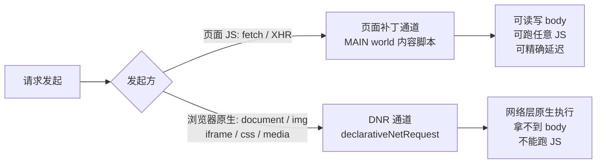

# Req Freedom 能力待办

对标 Requestly / ModHeader / XSwitch / Resource Override / tweak 的调研结论，拆成可逐项实现的清单。

- 优先级：**P0** 缺了就不完整 · **P1** 明显拉开体验差距 · **P2** 锦上添花
- 状态：`[ ]` 未开始 · `[~]` 进行中 · `[x]` 已完成

## 通道约束（动手前必读）

两条通道的能力边界不同，决定了每项功能只能落在哪一侧：

要点：

- **DNR 通道**能拦全部流量，但只能做声明式的 URL / Header 改写，**拿不到也改不了 body**，更不能跑 JS。
- **页面补丁通道**能力不受限，但**只拦得到页面 JS 发起的请求**，`document`、`img`、`iframe` 等浏览器原生发起的流量一律拦不到。
- 因此「改请求体」「JS 写响应」「Mock」「延迟」只能走页面补丁通道，这个边界要在文档站显式写清楚，否则用户会当成 bug 提。

## 一、核心能力（规则类型）

### 已具备

对应 `RuleType` 枚举，见 [packages/shared/src/enums.ts](packages/shared/src/enums.ts)。

- [x] `Block` 拦截阻断
- [x] `Redirect` 重定向（支持正则捕获组）
- [x] `InjectParams` 查询参数注入
- [x] `ModifyHeaders` 请求 / 响应 Header 改写
- [x] `MockResponse` 返回值 Mock
- [x] `Delay` 延迟模拟

> 这 6 项已覆盖同类插件的核心盘，属于合格的最小完备集。以下是相对竞品的实际缺口。

### 待补

- [x] **P0 · `InsertScript` 注入 JS / CSS**
  - 除 ModHeader 外家家都有，实现成本低——MAIN world 通道已经打通，直接复用。
  - 需要字段：注入代码、注入时机（`document_start` / `document_end`）、类型（JS / CSS）。
  - 已落地：复用 `interceptor.content.ts`（MAIN world），按页面 URL 命中后注入 `<script>` / `<style>`；每次页面加载去重注入一次。文档见 [脚本注入](apps/docs/docs/guide/features/insert-script.md)。

- [x] **P0 · 网络限速模拟**
  - 已落地：支持 Fast 3G、Slow 3G 与自定义网络延迟、上下行带宽；仅页面补丁通道可精确控制。

- [x] **P1 · `ModifyRequestBody` 改请求体**
  - Requestly 与 tweak 都支持，且都特别强调 GraphQL 场景。
  - **连带影响匹配器**：GraphQL 所有请求同 URL 同 method，只能靠 body 里的 `operationName` 区分，光靠 URL 匹配一定命不中。见「匹配能力增强」。
  - 通道：仅页面补丁。
  - 已落地：新增 `RuleType.ModifyRequestBody`，两种模式 `RequestBodyMode`（`replace` 整体替换 / `merge-json` JSON 深合并，`core.modifyRequestBody`）。复用 `interceptor.content.ts`（MAIN world），在 `fetch` / `XHR` 发送前改写请求体；Mock 命中时不改写（不发真实请求）。文档见 [改请求体](apps/docs/docs/guide/features/modify-request-body.md)。GraphQL 按 `operationName` 精确命中仍待「请求体匹配」落地。

- [ ] **P1 · 用 JS 动态生成响应**
  - Requestly 与 tweak 都支持；这是「静态 Mock」和「真·Mock 服务器」的分水岭。
  - 形态：在 `MockResponse` 上增加「函数模式」，暴露 `req` 入参，返回值作为响应体。
  - 安全：MAIN world 里 `eval` 用户代码，需在文档站明确风险边界。

- [ ] **P2 · `ReplaceString` 字符串替换**
  - 对 URL / 查询串做动态替换，不改源码。XSwitch 的常用姿势。

- [ ] **P2 · `ModifyUserAgent` UA 切换**
  - 本质是 `ModifyHeaders` 的预设特化，成本低，可作为语法糖实现。

- [ ] **P2 · Cookie 专项改写**
  - ModHeader 的差异化功能：改写 `Cookie` 请求头与 `Set-Cookie` 响应头（含各属性），不用动服务端。

### 匹配能力增强

- [ ] **P1 · Method 过滤** — 现在 `BaseRule` 只有 URL 维度，无法只拦 `POST`。
- [ ] **P1 · 请求体匹配** — GraphQL `operationName` 场景的前置依赖，与「改请求体」同批做。
- [ ] **P2 · 资源类型过滤** — `xhr` / `script` / `image` 等，DNR 原生支持。

## 二、工程化能力（规则之外）

> 长期看这部分比多加两个规则类型更影响留存——各家都有，我们一项都还没有。

- [x] **P0 · 规则分组 + 分组开关**
  - 规则一多，没有分组就没法用。XSwitch、Requestly 都有。
  - 数据结构上要先决定：`groupId` 外键，还是嵌套结构。**这项会动 storage schema，越早做迁移成本越低。**
  - 已落地：采用**嵌套结构**（`RuleGroup { id, name, enabled, rules: Rule[] }`），storage 顶层键 `req-freedom:groups`。生效判定 = 全局开关 && `group.enabled` && `rule.enabled`；`core.collectActiveRules(groups)` 统一扁平化，供 background（DNR）/ bridge（页面注入）/ popup 复用。options 支持分组卡片、组开关、就地重命名、组间/组内拖拽，规则编辑器可改「所属分组」实现跨组移动。

- [x] **P0 · 导入 / 导出**
  - ModHeader、tweak、XSwitch 全都有，是团队协作共享配置的前提。
  - 已落地：规则管理页可导入 / 导出完整 JSON 配置（全局开关 + 分组 + 规则），使用 `schemaVersion: 1`；导入会完整校验数据并经确认后整体替换，文档见[导入与导出配置](apps/docs/docs/guide/import-export.md)。

- [ ] **P1 · 作用域过滤（tab / 窗口 / 标签组）**
  - ModHeader 支持按 tab、窗口、标签组限定生效范围。
  - **这是安全考量而不只是便利性**：官方理由是防止 `Authorization` token 被误发到不想发的站点。

- [ ] **P1 · 动态变量**
  - ModHeader 免费提供，tweak 放在付费档。时间戳、随机数、UUID 等内置变量，规则里以占位符引用。

- [ ] **P1 · 常用规则模板库（含 CORS 解除预设）**
  - 内置一批开箱预设：解除 CORS（补 `Access-Control-Allow-*`）、禁用缓存、强制 HTTPS、常见移动端 UA。
  - 本质是 `ModifyHeaders` 的语法糖，但「解除 CORS」是本地联调第一高频需求，做成一键预设转化率高。可与 [P2 · `ModifyUserAgent`](#一核心能力规则类型) 的预设思路统一。

- [ ] **P1 · 图标徽标 + 全局暂停开关**
  - 扩展图标上显示当前生效规则数（`chrome.action.setBadgeText`）；popup 顶部一个总开关一键暂停全部规则。
  - 排查「是不是插件在捣乱」时，一键关远比逐条关重要，成本很低。

- [ ] **P1 · cURL / HAR 导入生成规则**
  - 粘贴 cURL → 自动生成 Redirect / Mock；导入 HAR → 批量生成 Mock。Requestly 有，对 mock 场景是利器。
  - 与上面的「导入 / 导出」同批做，复用 schema，边际成本低。

- [ ] **P1 · 内嵌代码编辑器（CodeMirror 6）**
  - 现在 `MockResponse.body` 用的是原生 `Textarea`，无高亮、无格式化。后续 `InsertScript`（注入 JS/CSS）、JS 动态生成响应、`ModifyRequestBody` 都要编辑代码/JSON，缺一个统一的编辑器组件。
  - 选型：用 **CodeMirror 6** 而非 Monaco。Monaco 的 Web Worker 语言服务与 MV3 的 CSP（`worker-src` / `script-src`）相性差、包体积 MB 级；CodeMirror 6 可按语言 tree-shake（几十~百 KB），MV3 下直接可跑，且当前只需 JSON/JS/CSS 高亮 + 格式化，用不到 Monaco 的 IntelliSense。
  - 落地：封装 `components/ui/code-editor`，`language` 传 `json` / `javascript` / `css`，按需引入 `@codemirror/lang-*`。先替换 `MockResponse.body` 的 `Textarea`，后续规则类型复用。
  - 若将来某功能确实需要 Monaco 级补全（如 JS 生成响应的 `req` 类型提示），再针对该功能单独评估。

- [ ] **P2 · JSONC 配置模式**
  - XSwitch 的核心产品决策：不做表单化 UI，而是一大段可注释、可 diff、可粘贴分享的配置文本。
  - 对开发者向工具很受欢迎。建议作为现有表单编辑器之外的**「高级模式」并存**，而非替换。
  - 复用上面的内嵌代码编辑器（`language="json"`，配 JSONC 解析）。

- [ ] **P2 · 随机 Mock 数据生成器**
  - tweak 的付费点。配合动态变量一起做，边际成本低。

- [ ] **P2 · 请求日志 / 命中高亮**
  - 让用户看见「哪条规则命中了哪个请求」，否则规则不生效时无从排查。

- [ ] **P2 · 规则命中测试器**
  - 输入一个 URL，实时显示命中哪条规则、改写后结果。与「请求日志」互补：那个是事后看，这个是事前验。
  - 正则 / 通配符匹配尤其需要即时预览，否则用户猜不中。

- [ ] **P2 · Profiles / 环境切换**
  - 与「规则分组」不同：分组是并存的收纳，Profiles 是**互斥的整套切换**（dev / staging / prod 各一套）。ModHeader 的核心功能。
  - **要和分组一起设计数据结构**，避免后期冲突。

- [ ] **P2 · 配置同步（`chrome.storage.sync`）**
  - 跟着浏览器账号跨设备自动同步规则，比手动导入导出体验高一档。
  - 注意 `storage.sync` 配额（单项 8KB / 总 100KB），大规则集需降级到 `storage.local`。

### 待评估

- [ ] **i18n 国际化** — 现文案为中文硬编码。若要承接 Resource Override 外流的海外用户（见「市场时机」），英文界面几乎是前提。
- [ ] **快捷键 + 右键菜单** — `commands` API 一键开关；页面右键「拦截此资源 / 为此接口建 Mock」，降低建规则门槛。

## 三、浏览器支持矩阵

WXT 本身支持多浏览器打包（`wxt build -b firefox / edge / safari`），Chromium 系（Edge / Opera / Brave / Arc / Vivaldi）几乎零改动即可复用 Chrome 产物。真正的移植风险只集中在**两个 API**上，而它俩正好都是 P0，选型阶段就要把「跨浏览器」纳入考量。

### 目标市场

| 浏览器 | 插件市场 | 内核 | 上架成本 |
| --- | --- | --- | --- |
| Chrome | Chrome Web Store | Chromium | 基准 |
| Edge | Edge Add-ons | Chromium | 同一份 Chromium 包直接上架，近乎免费 |
| Firefox | AMO | Gecko | 需换 `browser` 命名空间 + 验证 DNR 差异 |
| Safari | App Store | WebKit | 需 `safari-web-extension-converter` 转 App 壳 + Apple 开发者账号（$99/年） |
| Opera / Brave / Arc / Vivaldi | 多数直接装 Chrome 商店包 | Chromium | 基本免适配 |

### 关键 API 兼容性

决定每项能力能落在哪些浏览器：

| 能力 / API | Chrome / Edge | Firefox | Safari |
| --- | --- | --- | --- |
| `declarativeNetRequest`（DNR 通道） | ✅ 完整 | ⚠️ FF128+ 才支持 `modifyHeaders`，动态规则配额有差异 | ⚠️ 支持但 `redirect` / header 改写有 WebKit 限制 |
| MAIN world 内容脚本（页面补丁通道） | ✅ 111+ | ✅ 128+ | ❌ `world:'MAIN'` 基本不可靠 |
| File System Access API（读本地文件，`MapLocal` 已否决未采用） | ✅ 桌面版 | ❌ 无 `showDirectoryPicker` | ❌ 无 |
| `storage.sync` / `storage.local` | ✅ | ✅ | ✅ |
| `action.setBadgeText`（图标徽标） | ✅ | ✅ | ✅ |
| `commands`（快捷键） | ✅ | ✅ | ⚠️ 有限 |
| `scripting` API | ✅ | ✅ | ✅ |

### 对 ROADMAP 的影响

- **所有走页面补丁通道的功能**（`ModifyRequestBody`、JS 动态生成响应、精确延迟 / 限速）依赖 MAIN world，**Safari 上基本不可用**——Safari 版会退化成「只有 DNR 能力」的阉割版；Firefox 需 FF128+，可接受。
- **几乎无痛跨浏览器**：已完成的 6 种规则中走 DNR 的部分、导入导出、规则分组、徽标 + 全局开关、CodeMirror 编辑器、i18n、模板库——纯 UI / storage 或 DNR 声明式改写，可移植性好。

### 落地顺序建议

1. **Edge 优先**：同一份 Chromium 包直接上架，成本最低。
2. **Firefox 次之**：代码统一改用 WXT 提供的 `browser` 命名空间（基于 webextension-polyfill），再验证 DNR 差异。
3. **Safari 最后**：转 App 壳 + 年费 + MAIN world 缺失，成本最高且功能阉割，需权衡投入产出。

> 前置改造：现有代码若直接用 `chrome.*`，应统一换成 `browser.*` 命名空间，这是跨浏览器的基础前提。

## 四、市场时机

Resource Override 因未升级 MV3 已经停止维护，用户正在外流寻找替代品。我们用 WXT + MV3 起步，正好接得住这波需求——**优先补齐 `InsertScript` 性价比最高**。Resource Override 的另一核心 `MapLocal` 在 MV3 下已无法完整实现（见[附录](#附录已否决的能力)），改用「Redirect 到本地服务」承接。

## 附录：已否决的能力

- **`MapLocal` 映射本地文件 — 不做**（技术验证：[docs/spike-maplocal.md](docs/spike-maplocal.md)）
  - 验证后否决。拆开看，能做的部分已被现有能力覆盖，不能做的部分正是 MV3 的硬约束：
    - **映射到本地服务**（`localhost`）等于现有 `Redirect`，无需新增规则类型，需要时给 Redirect 加个预设入口即可。
    - **映射到磁盘文件**在 MV3 下只能走页面补丁通道、**仅覆盖 `fetch`/`XHR`**，与 `MockResponse` 高度重叠；而竞品真正的卖点——把 `script`/`img`/`css`/`iframe` 等浏览器原生请求映射到裸文件——MV3 做不到（DNR 改不了 body，`blob:`/`data:` 又不能作重定向目标）。
  - 替代方案：文档站在 `Redirect` 页说明「起本地 dev server + 重定向到 localhost」这一标准姿势，并解释 MV3 下为何不能直接 map 裸文件。

## 参考

- [Requestly HTTP Rule Types](https://interceptor-docs.requestly.com/llms.txt)
- [ModHeader](https://app.modheader.com/)
- [XSwitch](https://github.com/yize/xswitch)
- [Resource Override](https://github.com/kylepaulsen/ResourceOverride)
- [tweak](https://tweak-extension.com/docs/intro)
