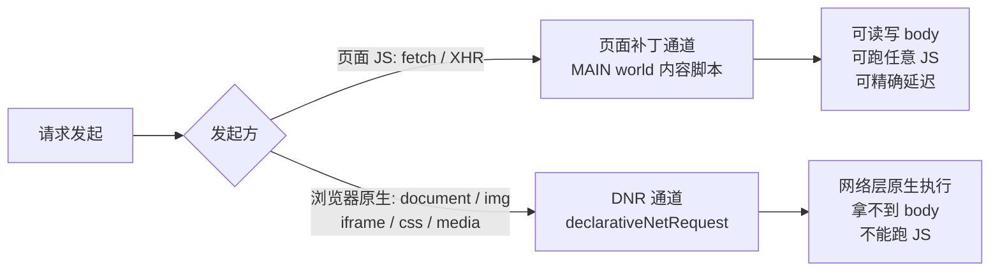

# Req Freedom 能力待办

对标 Requestly / ModHeader / XSwitch / Resource Override / tweak 的调研结论，拆成可逐项实现的清单。

- 优先级：**P0** 缺了就不完整 · **P1** 明显拉开体验差距 · **P2** 锦上添花
- 状态：`[ ]` 未开始 · `[~]` 进行中 · `[x]` 已完成

## 通道约束（动手前必读）

两条通道的能力边界不同，决定了每项功能只能落在哪一侧：

要点：

- **DNR 通道**能拦全部流量，但只能做声明式的 URL / Header 改写，**拿不到也改不了 body**，更不能跑 JS。
- **页面补丁通道**能力不受限，但**只拦得到页面 JS 发起的请求**，`document`、`img`、`iframe` 等浏览器原生发起的流量一律拦不到。
- 因此「改请求体」「JS 写响应」「Mock」「延迟」只能走页面补丁通道，这个边界要在文档站显式写清楚，否则用户会当成 bug 提。

## 一、核心能力（规则类型）

### 已具备

对应 `RuleType` 枚举，见 [packages/shared/src/enums.ts](packages/shared/src/enums.ts)。

- [x] `Block` 拦截阻断
- [x] `Redirect` 重定向（支持正则捕获组）
- [x] `InjectParams` 查询参数注入
- [x] `ModifyHeaders` 请求 / 响应 Header 改写
- [x] `MockResponse` 返回值 Mock
- [x] `Delay` 延迟模拟

> 这 6 项已覆盖同类插件的核心盘，属于合格的最小完备集。以下是相对竞品的实际缺口。

### 待补

- [ ] **P0 · `MapLocal` 映射本地文件**
  - 把线上资源映射到本地文件，前端调试第一刚需；XSwitch 与 Resource Override 存在的全部理由。
  - 实现要点：MV3 沙箱读不到任意本地路径，需走 File System Access API 授权目录句柄，或退化为「粘贴文件内容存 storage」。**先做技术验证再排期**，这项的实现方式不确定性最大。
  - 通道：DNR（重定向到 `blob:` / 扩展内资源）或页面补丁，取决于选型。

- [ ] **P0 · `InsertScript` 注入 JS / CSS**
  - 除 ModHeader 外家家都有，实现成本低——MAIN world 通道已经打通，直接复用。
  - 需要字段：注入代码、注入时机（`document_start` / `document_end`）、类型（JS / CSS）。

- [ ] **P1 · `ModifyRequestBody` 改请求体**
  - Requestly 与 tweak 都支持，且都特别强调 GraphQL 场景。
  - **连带影响匹配器**：GraphQL 所有请求同 URL 同 method，只能靠 body 里的 `operationName` 区分，光靠 URL 匹配一定命不中。见「匹配能力增强」。
  - 通道：仅页面补丁。

- [ ] **P1 · 用 JS 动态生成响应**
  - Requestly 与 tweak 都支持；这是「静态 Mock」和「真·Mock 服务器」的分水岭。
  - 形态：在 `MockResponse` 上增加「函数模式」，暴露 `req` 入参，返回值作为响应体。
  - 安全：MAIN world 里 `eval` 用户代码，需在文档站明确风险边界。

- [ ] **P2 · `ReplaceString` 字符串替换**
  - 对 URL / 查询串做动态替换，不改源码。XSwitch 的常用姿势。

- [ ] **P2 · `ModifyUserAgent` UA 切换**
  - 本质是 `ModifyHeaders` 的预设特化，成本低，可作为语法糖实现。

- [ ] **P2 · Cookie 专项改写**
  - ModHeader 的差异化功能：改写 `Cookie` 请求头与 `Set-Cookie` 响应头（含各属性），不用动服务端。

### 匹配能力增强

- [ ] **P1 · Method 过滤** — 现在 `BaseRule` 只有 URL 维度，无法只拦 `POST`。
- [ ] **P1 · 请求体匹配** — GraphQL `operationName` 场景的前置依赖，与「改请求体」同批做。
- [ ] **P2 · 资源类型过滤** — `xhr` / `script` / `image` 等，DNR 原生支持。

## 二、工程化能力（规则之外）

> 长期看这部分比多加两个规则类型更影响留存——各家都有，我们一项都还没有。

- [ ] **P0 · 规则分组 + 分组开关**
  - 规则一多，没有分组就没法用。XSwitch、Requestly 都有。
  - 数据结构上要先决定：`groupId` 外键，还是嵌套结构。**这项会动 storage schema，越早做迁移成本越低。**

- [ ] **P0 · 导入 / 导出**
  - ModHeader、tweak、XSwitch 全都有，是团队协作共享配置的前提。
  - 需要 schema version 字段，为后续迁移留出空间。

- [ ] **P1 · 作用域过滤（tab / 窗口 / 标签组）**
  - ModHeader 支持按 tab、窗口、标签组限定生效范围。
  - **这是安全考量而不只是便利性**：官方理由是防止 `Authorization` token 被误发到不想发的站点。

- [ ] **P1 · 动态变量**
  - ModHeader 免费提供，tweak 放在付费档。时间戳、随机数、UUID 等内置变量，规则里以占位符引用。

- [ ] **P2 · JSONC 配置模式（Monaco 编辑器）**
  - XSwitch 的核心产品决策：不做表单化 UI，而是一大段可注释、可 diff、可粘贴分享的配置文本。
  - 对开发者向工具很受欢迎。建议作为现有表单编辑器之外的**「高级模式」并存**，而非替换。

- [ ] **P2 · 随机 Mock 数据生成器**
  - tweak 的付费点。配合动态变量一起做，边际成本低。

- [ ] **P2 · 请求日志 / 命中高亮**
  - 让用户看见「哪条规则命中了哪个请求」，否则规则不生效时无从排查。

## 三、市场时机

Resource Override 因未升级 MV3 已经停止维护，用户正在外流寻找替代品。我们用 WXT + MV3 起步，正好接得住这波需求——**优先补齐 `MapLocal` 与 `InsertScript`（Resource Override 的两大核心）性价比最高**。

## 参考

- [Requestly HTTP Rule Types](https://interceptor-docs.requestly.com/llms.txt)
- [ModHeader](https://app.modheader.com/)
- [XSwitch](https://github.com/yize/xswitch)
- [Resource Override](https://github.com/kylepaulsen/ResourceOverride)
- [tweak](https://tweak-extension.com/docs/intro)
