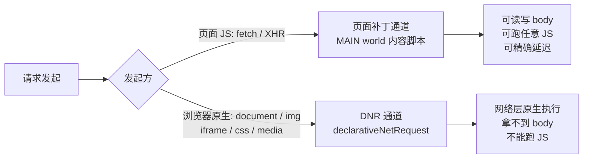

# Req Freedom 能力待办

对标 Requestly / ModHeader / XSwitch / Resource Override / tweak 的调研结论，拆成可逐项实现的清单。

- 优先级：**P0** 缺了就不完整 · **P1** 明显拉开体验差距 · **P2** 锦上添花
- 状态：`[ ]` 未开始 · `[~]` 进行中 · `[x]` 已完成

## 通道约束（动手前必读）

两条通道的能力边界不同，决定了每项功能只能落在哪一侧：

```mermaid
flowchart LR
    A[请求发起] --> B{发起方}
    B -->|页面 JS: fetch / XHR| C[页面补丁通道<br/>MAIN world 内容脚本]
    B -->|浏览器原生: document / img<br/>iframe / css / media| D[DNR 通道<br/>declarativeNetRequest]
    C --> E[可读写 body<br/>可跑任意 JS<br/>可精确延迟]
    D --> F[网络层原生执行<br/>拿不到 body<br/>不能跑 JS]
```

要点：

- **DNR 通道**能拦全部流量，但只能做声明式的 URL / Header 改写，**拿不到也改不了 body**，更不能跑 JS。
- **页面补丁通道**能力不受限，但**只拦得到页面 JS 发起的请求**，`document`、`img`、`iframe` 等浏览器原生发起的流量一律拦不到。
- **页面补丁通道还只作用于顶层文档**：内容脚本未开启 `all_frames`，iframe 内部页面 JS 发起的 fetch / XHR 同样拦不到，命中统计也不会包含。这与上一条是两个维度——上一条讲请求由谁发起，这一条讲文档层级。
- **同步 XHR（`open(..., false)`）也拦不到**：该通道的处理全是异步的，而同步 XHR 要求 `send` 返回时响应已就绪，因此一律原样放行——fail-open，宁可规则不生效也不破坏页面。
- 因此「改请求体」「JS 写响应」「Mock」「延迟」只能走页面补丁通道，这个边界要在文档站显式写清楚，否则用户会当成 bug 提。

## 一、核心能力（执行通道与动作）

### 已具备

规则模型已收敛为 `RuleExecutionChannel`（`dnr` / `page-patch`）与可组合的 `RuleActionType`，见 [packages/shared/src/enums.ts](packages/shared/src/enums.ts)。请求方法是每条规则的公共匹配条件；编辑器会基于通道和方法仅展示可执行的动作。

- [x] `Block` 拦截阻断
- [x] `Redirect` 重定向（支持正则捕获组）
- [x] `InjectParams` 查询参数注入
- [x] `ModifyHeaders` 请求 / 响应 Header 改写
- [x] `MockResponse` 返回值 Mock
- [x] `Delay` 延迟模拟

> 这 6 项已覆盖同类插件的核心盘，属于合格的最小完备集。以下是相对竞品的实际缺口。

### 待补

- [x] ~~**P0 · `InsertScript` 注入 JS / CSS**~~ — 复用 `interceptor.content.ts`（MAIN world），按页面 URL 命中后注入 `<script>` / `<style>`，支持 `document_start` / `document_end` 时机与 JS / CSS 类型；每次页面加载去重注入一次。文档见 [脚本注入](apps/docs/docs/guide/features/insert-script.md)。

- [x] ~~**P0 · 网络限速模拟**~~ — 支持 Fast 3G、Slow 3G 与自定义网络延迟、上下行带宽；仅页面补丁通道可精确控制。

- [x] ~~**P1 · `ModifyRequestBody` 改请求体**~~ — 仅页面补丁通道；静态改写支持 `RequestBodyMode`（`replace` 整体替换 / `merge-json` JSON 深合并，`core.modifyRequestBody`），`RequestBodySourceMode.Dynamic` 以 `req` 快照动态生成并支持 `return` / `await`。在 `fetch` / `XHR` 发送前改写，Mock 命中时不改写；GraphQL 按 `operationName` 精确命中由「请求体匹配」承载。文档见 [改请求体](apps/docs/docs/guide/features/modify-request-body.md)。

- [x] ~~**P1 · 用 JS 动态生成响应**~~ — `MockResponseMode` 支持静态响应体与 JavaScript 动态生成；动态函数可用 `req` 的 URL、方法、请求头、查询参数与请求体（含可选 JSON 解析），支持 `return` / `await`，fetch 与 XHR 均由 MAIN world 拦截执行，文档明确仅应运行可信代码的安全边界。

- [x] ~~**P1 · 基于真实响应改写（Mock 包装模式）**~~ — `MockResponseAction` 新增可选 `passthrough`（仅 `MockResponseMode.Dynamic` 可开）。关闭时保持既有短路语义（不发真实请求）；开启时切换为包装语义：先发出真实请求（同规则的改请求体先生效），把真实响应以 `res` 快照（`status` / `statusText` / `ok` / `headers` / `body` / `json`）连同 `req` 一起交给动态函数，用返回值替换响应体，状态码与响应头一律沿用真实响应；函数不返回值或抛异常时保留真实响应体。XHR 侧页面持有的实例全程不 `send`，真实请求由影子实例（`originalOpen` / `originalSend`）承载，避免原生同步事件抢在异步函数之前交付响应；不透明响应（`no-cors`）原样放行。文档见 [基于真实响应改写](apps/docs/docs/guide/features/mock.md#基于真实响应改写)。

### 匹配能力增强

- [x] ~~**P1 · Method 过滤**~~ — 规则通过 `methods` 支持 GET / POST / PUT / PATCH / DELETE / HEAD / OPTIONS；空数组表示全部。改请求体必须显式选择可带 body 的方法；选择全部、GET 或 HEAD 时，表单层会禁用该动作，避免浏览器拒绝带 body 的请求。
- [x] ~~**P1 · 请求体匹配**~~ — 规则可选 `bodyMatch` 条件（`BodyMatchType`：`contains` 子串 / `regex` 正则 / `graphql-operation` 操作名），与 URL、方法并列。仅页面补丁通道生效：`interceptor.content.ts` 先按 URL + 方法初筛，命中规则含请求体条件时读取一次请求体再经 `core.filterRulesByBody` 二次过滤（`core.rulesNeedBody` 决定是否需要读取，无条件规则不额外读体）。GraphQL 同 URL 的多个操作可用「操作名」精确区分。文档见 [请求体匹配](apps/docs/docs/guide/features/request-body-match.md)。

## 二、工程化能力（规则之外）

> 长期看这部分比多加两个规则类型更影响留存——各家都有，我们一项都还没有。

- [x] ~~**P0 · 规则分组 + 分组开关**~~ — 采用嵌套结构（`RuleGroup { id, name, enabled, rules: Rule[] }`），storage 顶层键 `req-freedom:groups`；生效判定 = 全局开关 && `group.enabled` && `rule.enabled`，`core.collectActiveRules(groups)` 统一扁平化供 background / bridge / popup 复用。options 支持分组卡片、组开关、就地重命名、组间/组内拖拽，规则编辑器可改「所属分组」跨组移动。

- [x] ~~**P0 · 导入 / 导出**~~ — 规则管理页可导入 / 导出完整 JSON 配置（全局开关 + 分组 + 统一规则），当前 `schemaVersion: 2`；导入完整校验通道、动作、请求方法与正则并经确认后整体替换。文档见 [导入与导出配置](apps/docs/docs/guide/import-export.md)。

- [x] ~~**P1 · 作用域过滤（tab / 窗口 / 标签组）**~~ — 规则新增可选 `scope`（`RuleScopeType`：`all-tabs` / `tab` / `window` / `tab-group`，多选目标）。两条通道均生效：页面补丁按桥接脚本自身 `tabId` / `windowId` / `groupId` 过滤（`core.matchScope`），DNR 把作用域解析成 `tabId` 集合以 session 规则的 `tabIds` 条件承载（`utils/scope.resolveScopeTabIds`）并随标签事件重算，不限定作用域的规则仍走可跨重启的 dynamic 规则；编辑器实时列出可选对象，已关闭目标标注失效（fail-closed）。文档见 [作用域过滤](apps/docs/docs/guide/features/scope-filter.md)。

- [x] ~~**P1 · 动态变量**~~ — 取值字段支持 `{{变量}}` 占位符（`{{uuid}}` / `{{timestamp}}` / `{{timestampMs}}` / `{{isoTime}}` / `{{randomFloat}}` / `{{randomInt(min,max)}}` / `{{randomString(length)}}`），元数据在 `shared` 单一维护，解析器 `core.resolveDynamicVariables`。页面补丁通道（静态 Mock 响应体 / 响应头、静态改请求体）逐请求求值，DNR 通道（重定向 / 注入参数 / Header 值）在规则同步时解析一次，未识别占位符原样保留；编辑器提供「变量」浮层一键复制占位符。文档见 [动态变量](apps/docs/docs/guide/features/dynamic-variables.md)。

- [x] ~~**P1 · 常用规则模板库（含 CORS 解除预设）**~~ — 内置一批开箱预设：解除 CORS（补 `Access-Control-Allow-*`）、禁用缓存、强制 HTTPS、移动端 UA（iPhone / Android）。模板在 `shared` 单一维护（`RULE_TEMPLATES`），选用后不直接落库而是把预填草稿交给规则编辑器微调匹配范围（`utils/factories.instantiateRuleTemplate`），入口收在「添加规则 / 新建规则」下拉里，从某分组进入即落到该组。文档见 [常用规则模板库](apps/docs/docs/guide/features/template-library.md)。

- [x] ~~**P1 · 图标徽标 + 全局暂停开关**~~ — 统计以「命中日志」为唯一原始数据，总数与逐规则计数都是它的投影。图标徽标只表达状态（本页有规则生效即点亮），数量在 popup 内按规则展示并可一键清空。DNR 通道的命中由观测式 `webRequest` 配合 `core.findMatchedRules` 判定，页面补丁通道在执行计划中同步产出。顶部总开关同步暂停两条执行通道。文档见 [查看规则命中](apps/docs/docs/guide/getting-started.md#查看规则命中)，设计依据见 [docs/refactor-rule-hit.md](docs/refactor-rule-hit.md)。

- [x] ~~**P1 · cURL / HAR 导入生成规则**~~ — cURL 以安全解析方式提取 URL、方法与 GraphQL 操作，选择 Redirect / Mock 后进入原有单条编辑器补齐配置；HAR 读取 Fetch / XHR 文本响应，批量生成静态 Mock，支持统一选择分组、逐条选择、手风琴编辑、重复请求提示与安全停用策略。两者复用统一 `Rule` 模型和校验，但以追加方式保存，不会触发现有配置导入的整体替换语义。XHR Mock 同步补齐响应头 API、状态说明、响应 URL 与常见 `responseType`。文档见 [从 cURL / HAR 创建规则](apps/docs/docs/guide/features/curl-har-import.md)。

- [x] ~~**P1 · 内嵌代码编辑器（CodeMirror 6）**~~ — 封装 `components/ui/code-editor`，支持 JSON / JavaScript / CSS 的语法高亮、行号、括号匹配、缩进与格式化，按语言 tree-shake（`@codemirror/lang-*`）以适配 MV3 CSP；`MockResponse.body` 已切换为 JSON 编辑器，后续规则类型复用。若将来需 Monaco 级补全再单独评估。

- [x] ~~**P2 · 请求日志 / 命中高亮**~~ — 复用既有命中日志，不新增数据源：规则管理页顶栏新增「请求日志」视图，逐条展示时间、方法、请求 URL、命中规则、动作与执行结果（已生效 / 未应用及原因），并按规则给出命中次数供一键下钻；支持按关键词（URL / 方法 / 规则名）、动作与执行结果筛选，点击规则名跳回规则视图定位高亮。日志按标签页归档，面板顶部选择标签页；入口即规则统计区新增的「命中记录」卡片（数字为各标签页合计条数，随命中实时增长），日志视图左上角提供返回，清空前二次确认。初次读取走消息拿 background 内存中的权威日志（`RUNTIME_MSG_GET_RULE_HIT_LOG` / `RUNTIME_MSG_LIST_RULE_HIT_TABS`），随后订阅 `storage.session` 镜像实时刷新（约 1 秒一次），不额外唤醒 Service Worker。文档见 [请求日志](apps/docs/docs/guide/features/request-log.md)。

- [ ] **P2 · Profiles / 环境切换**
  - 与「规则分组」不同：分组是并存的收纳，Profiles 是**互斥的整套切换**（dev / staging / prod 各一套）。ModHeader 的核心功能。
  - **要和分组一起设计数据结构**，避免后期冲突。

- [ ] **P2 · 配置同步（`chrome.storage.sync`）**
  - 跟着浏览器账号跨设备自动同步规则，比手动导入导出体验高一档。
  - 注意 `storage.sync` 配额（单项 8KB / 总 100KB），大规则集需降级到 `storage.local`。

### 待评估

- [ ] **i18n 国际化** — 现文案为中文硬编码。若要承接 Resource Override 外流的海外用户（见「市场时机」），英文界面几乎是前提。
- [ ] **快捷键 + 右键菜单** — `commands` API 一键开关；页面右键「拦截此资源 / 为此接口建 Mock」，降低建规则门槛。

## 三、浏览器支持矩阵

WXT 本身支持多浏览器打包（`wxt build -b firefox / edge / safari`），Chromium 系（Edge / Opera / Brave / Arc / Vivaldi）几乎零改动即可复用 Chrome 产物。真正的移植风险只集中在**两个 API**上，而它俩正好都是 P0，选型阶段就要把「跨浏览器」纳入考量。

### 目标市场

| 浏览器 | 插件市场 | 内核 | 上架成本 |
| --- | --- | --- | --- |
| Chrome | Chrome Web Store | Chromium | 基准 |
| Edge | Edge Add-ons | Chromium | 同一份 Chromium 包直接上架，近乎免费 |
| Firefox | AMO | Gecko | 需换 `browser` 命名空间 + 验证 DNR 差异 |
| Safari | App Store | WebKit | 需 `safari-web-extension-converter` 转 App 壳 + Apple 开发者账号（$99/年） |
| Opera / Brave / Arc / Vivaldi | 多数直接装 Chrome 商店包 | Chromium | 基本免适配 |

### 关键 API 兼容性

决定每项能力能落在哪些浏览器：

| 能力 / API | Chrome / Edge | Firefox | Safari |
| --- | --- | --- | --- |
| `declarativeNetRequest`（DNR 通道） | ✅ 完整 | ⚠️ FF128+ 才支持 `modifyHeaders`，动态规则配额有差异 | ⚠️ 支持但 `redirect` / header 改写有 WebKit 限制 |
| MAIN world 内容脚本（页面补丁通道） | ✅ 111+ | ✅ 128+ | ❌ `world:'MAIN'` 基本不可靠 |
| File System Access API（读本地文件，`MapLocal` 已否决未采用） | ✅ 桌面版 | ❌ 无 `showDirectoryPicker` | ❌ 无 |
| `storage.sync` / `storage.local` | ✅ | ✅ | ✅ |
| `action.setBadgeText`（状态徽标） | ✅ | ✅ | ✅ |
| `webRequest` 观测式监听（命中统计数据源） | ✅ | ✅ | ⚠️ 支持有限，统计能力下降 |
| `commands`（快捷键） | ✅ | ✅ | ⚠️ 有限 |
| `scripting` API | ✅ | ✅ | ✅ |

### 对 ROADMAP 的影响

- **所有走页面补丁通道的功能**（`ModifyRequestBody`、JS 动态生成响应、精确延迟 / 限速）依赖 MAIN world，**Safari 上基本不可用**——Safari 版会退化成「只有 DNR 能力」的阉割版；Firefox 需 FF128+，可接受。
- **几乎无痛跨浏览器**：已完成的 6 种规则中走 DNR 的部分、导入导出、规则分组、徽标 + 全局开关、CodeMirror 编辑器、i18n、模板库——纯 UI / storage 或 DNR 声明式改写，可移植性好。

### 落地顺序建议

1. **Edge 优先**：同一份 Chromium 包直接上架，成本最低。
2. **Firefox 次之**：代码统一改用 WXT 提供的 `browser` 命名空间（基于 webextension-polyfill），再验证 DNR 差异。
3. **Safari 最后**：转 App 壳 + 年费 + MAIN world 缺失，成本最高且功能阉割，需权衡投入产出。

> 前置改造：现有代码若直接用 `chrome.*`，应统一换成 `browser.*` 命名空间，这是跨浏览器的基础前提。

## 四、市场时机

Resource Override 因未升级 MV3 已经停止维护，用户正在外流寻找替代品。我们用 WXT + MV3 起步，正好接得住这波需求——**优先补齐 `InsertScript` 性价比最高**。Resource Override 的另一核心 `MapLocal` 在 MV3 下已无法完整实现（见[附录](#附录已否决的能力)），改用「Redirect 到本地服务」承接。

## 附录：已否决的能力

- **`ReplaceString` 字符串替换 — 不做**
  - **现有能力已经覆盖主要场景**。URL 与路径替换可使用 `Redirect` 的正则捕获组，查询参数增改由 `InjectParams` 承担，响应体局部替换可使用「基于真实响应改写」。
  - **作为独立动作的增量只是语法糖**。新增规则类型需要同步维护共享协议、持久化校验、导入导出、执行通道、编辑器、本地化文案与文档，投入与收益不匹配。
  - **DNR 无法完整复刻 XSwitch 的全局字符串替换语义**。`regexSubstitution` 适合通过捕获组拼装目标 URL，但不能用一条通用规则可靠替换 URL 中任意数量的同名子串；若改走页面补丁通道，又只能覆盖 `fetch` / XHR。
  - 替代方案：若后续用户需求明确，在 `Redirect` 编辑器内提供「简单字符串替换」快捷模式与结果预览，底层仍使用现有 Redirect 规则，不新增 `RuleActionType`。

- **`ModifyUserAgent` UA 切换 — 不做**
  - **现有能力已经覆盖**。`ModifyHeaders` 可以改写请求的 `User-Agent`，模板库也已提供 iPhone 与 Android 两个移动端 UA 预设，无需新增独立规则类型。
  - **单独修改 UA 不等于完整设备模拟**。现代浏览器还会发送 `Sec-CH-UA*` Client Hints，仅改写 `User-Agent` 可能产生互相矛盾的设备信息；完整模拟应交给浏览器开发者工具。
  - 替代方案：按需求继续扩充 Header 模板，并在需要时让模板成组改写 UA 与相关 Client Hints，底层仍使用 `ModifyHeaders`。

- **Cookie 专项改写 — 不做**
  - **基础能力已经覆盖**。`ModifyHeaders` 已支持对请求 `Cookie` 和响应 `Set-Cookie` 执行设置、追加与移除，现有 Header 编辑器可以直接配置完整值。
  - **专项功能的主要增量只是结构化输入**。按 Cookie 名编辑以及 `Domain`、`Path`、`Expires`、`SameSite`、`Secure` 等属性能降低手写成本，但不构成新的执行能力，不值得新增规则类型。
  - **DNR 无法对动态值做精细的局部改写**。它可以设置或移除完整 Header，却不能读取服务端返回的 `Set-Cookie` 后仅修改其中某个属性；页面补丁通道也无法可靠介入浏览器 Cookie 存储语义。
  - 替代方案：若后续需求明确，在 `ModifyHeaders` 中增加 Cookie / Set-Cookie 模板或结构化输入辅助，最终仍生成现有 Header 修改项。

- **资源类型过滤 — 不做**
  - **只有 DNR 通道能准确识别资源类型**。DNR 原生支持 `xhr`、`script`、`image` 等条件，但页面补丁通道只能拦截 `fetch` / XHR，无法为统一规则模型提供一致语义。
  - **收益不足以覆盖协议复杂度**。新增公共匹配字段需要同步维护共享协议、核心过滤、持久化校验、导入导出、编辑器与双通道行为说明，却只增强部分 DNR 规则。
  - 替代方案：使用 URL 路径、文件扩展名、请求方法与作用域缩小匹配范围；若未来出现明确的高频需求，再以 DNR 专属高级条件单独评估。

- **随机 Mock 数据生成器 — 不做**
  - **现有能力已经覆盖主要场景**。静态 Mock 可通过 `{{uuid}}`、`{{randomInt}}`、`{{randomFloat}}`、`{{randomString}}` 等动态变量逐请求生成简单随机值，复杂对象与数组可使用 JavaScript 动态 Mock。
  - **完整生成器的产品与工程成本较高**。Faker / JSON Schema 式生成需要处理字段类型、数组长度、关联字段、地区语言与随机种子，还会增加编辑器复杂度和扩展包体积，但生成结果仍难以自动满足真实业务约束。
  - **不属于请求调试主链路**。与请求日志、命中排查和规则测试相比，这项能力使用频率与投入产出都更低，不应仅因竞品将其作为付费点而实现。
  - 替代方案：根据明确需求继续增加 `{{randomBoolean}}`、`{{randomChoice(...)}}` 等轻量动态变量；复杂数据继续使用动态 Mock 函数。

- **JSONC 配置模式 — 不做**
  - 原设想：对标 XSwitch，提供一大段可注释、可 diff、可粘贴分享的配置文本，作为表单编辑器之外的「高级模式」并存。
  - 否决理由：
    - **核心诉求已被现有能力覆盖**。「整份配置可粘贴、可 diff、可分享」由[导入 / 导出配置](apps/docs/docs/guide/import-export.md)承担，导出的就是完整 JSON；真正的增量只剩「能写注释」，不值得为此再开一条编辑通道。
    - **双份数据源的持续成本**。注释在「文本 → 对象 → 再序列化」的往返中必然丢失，要保真就得把 JSONC 原文与结构化 `groups` 一起持久化，并长期维护两者的同步与冲突提示；后续每加一个规则字段都要同时照顾表单和文本两侧。
    - **表单改动后注释仍会丢**。除非把每次表单编辑都映射成 JSON path 增量改写，否则「改了表单、注释没了」会是常态——这正是该模式最主要的卖点失效的地方。
  - 替代方案：需要注释与版本管理的用户，导出 JSON 后在自己的仓库里维护，再导入回来。

- **`MapLocal` 映射本地文件 — 不做**（技术验证：[docs/spike-maplocal.md](docs/spike-maplocal.md)）
  - 验证后否决。拆开看，能做的部分已被现有能力覆盖，不能做的部分正是 MV3 的硬约束：
    - **映射到本地服务**（`localhost`）等于现有 `Redirect`，无需新增规则类型，需要时给 Redirect 加个预设入口即可。
    - **映射到磁盘文件**在 MV3 下只能走页面补丁通道、**仅覆盖 `fetch`/`XHR`**，与 `MockResponse` 高度重叠；而竞品真正的卖点——把 `script`/`img`/`css`/`iframe` 等浏览器原生请求映射到裸文件——MV3 做不到（DNR 改不了 body，`blob:`/`data:` 又不能作重定向目标）。
  - 替代方案：文档站在 `Redirect` 页说明「起本地 dev server + 重定向到 localhost」这一标准姿势，并解释 MV3 下为何不能直接 map 裸文件。

- **规则命中测试器（输入 URL 模拟整条链路） — 不做**
  - 原设想：输入一个 URL，实时显示命中哪条规则与改写后结果，与[请求日志](apps/docs/docs/guide/features/request-log.md)构成「事后看 / 事前验」的互补。
  - 否决理由：
    - **最需要预演的能力恰好是它验不了的**。模拟器只能做静态求值：动态 Mock 不能执行、「基于真实响应改写」拿不到真实响应、`InsertScript` 不会运行。它能说清楚的只剩 `Block` / `Redirect` / `InjectParams`——恰好是最简单、最不容易配错的三个动作。
    - **它要求用户先猜一个 URL**。真实排查中 URL 来自 DevTools 或请求日志，人已经站在日志面前了；此时「事前验」多数只是「事后看」的更差版本。
    - **忠实模拟 DNR 需要引入第三套匹配语义**。网络层真正执行的是 `toDnrRules` 编译出的 condition，与统计侧的 `core.findMatchedRules` 已知存在偏差（见 [dnr-match-parity.test.ts](apps/extension/utils/dnr-match-parity.test.ts) 钉住的 Wildcard 用例）。再加一个模拟器，就会出现「测试器说命中、请求日志说没有、页面实际被拦」的三方不一致，比现在单向少报更难解释。何况用户正则若不被 DNR 的 RE2 接受，规则压根没注册成功（`DnrRegistrationIssues` 已记录这一事实），而纯 JS 模拟器仍会自信地报命中——它会获得一种原实现没有的说谎方式。
  - 替代方案：真实痛点是「规则没生效，而日志里什么都没有」——日志只记录命中过的请求，未命中时以沉默回答「为什么」。若后续需求明确，应做**请求诊断模式**而非模拟器：按标签页开关，把未命中的请求也记入既有请求日志，点开任意一条逐规则显示卡在哪个条件（URL / 方法 / 请求体 / 作用域 / 通道拦不到该发起方）。真实 URL、真实上下文、零猜测，且复用现有日志界面与 `webRequest` 观测器。
  - 不受影响：规则编辑器内已有的轻量命中测试（匹配内容右侧的烧瓶按钮）保留。它只在编写规则的当下验「这个模式能不能匹配上」，属于表单校验的延伸，不承担模拟整条链路的职责。但它沿用 `core.matchUrl`（页面补丁语义），对 DNR 通配规则给出的范围比实际更窄，需在气泡内注明适用范围。

## 参考

- [Requestly HTTP Rule Types](https://interceptor-docs.requestly.com/llms.txt)
- [ModHeader](https://app.modheader.com/)
- [XSwitch](https://github.com/yize/xswitch)
- [Resource Override](https://github.com/kylepaulsen/ResourceOverride)
- [tweak](https://tweak-extension.com/docs/intro)
