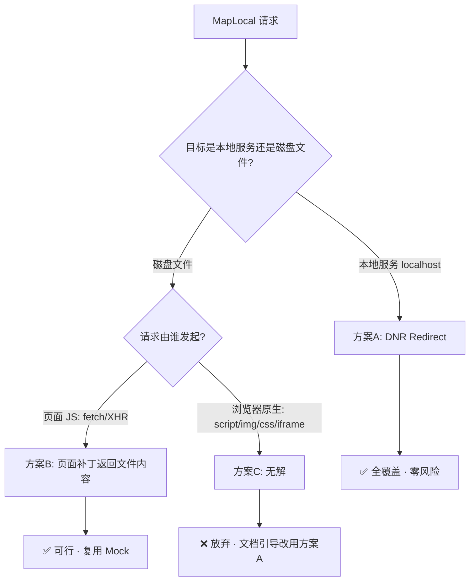

# MapLocal 映射本地文件 · 技术验证

对应 ROADMAP 中 **P0 · `MapLocal`**：把线上资源映射到本地文件。该项在排期前需要先验证实现方式，本文给出结论、依据与落地拆解。

## 结论先行

| 子能力 | 覆盖的请求类型 | 通道 | 可行性 | 建议 |
| --- | --- | --- | --- | --- |
| 映射到**本地服务**（`http://localhost:*`） | 全部（含 `script`/`img`/`css`/`iframe`/导航） | DNR | ✅ 已具备，等于现有 Redirect | 直接做成 Redirect 的预设 UX，零技术风险 |
| 映射到**磁盘文件** · 页面 JS 请求（`fetch`/`XHR`） | 仅页面脚本发起的请求 | 页面补丁 | ✅ 可行 | 复用 Mock 那套响应伪造 |
| 映射到**磁盘文件** · 浏览器原生请求 | `script`/`img`/`css`/`iframe`/导航 | — | ❌ **MV3 下不可行** | 引导用户改用「本地服务」模式 |

一句话：**「映射到本地起的服务」现在就能做且能全覆盖；「直接映射磁盘上的裸文件」只能覆盖页面 JS 发起的请求，浏览器原生发起的静态资源在 MV3 里无解。** 这条边界必须写进文档，否则用户拿它去 map 一个 `<script src>` 会当成 bug。

## 一、问题定义

MapLocal 的诉求是「请求 `https://cdn.site/app.js`，实际拿到我本地的内容」。本地内容有两种形态，实现路径完全不同：

1. **本地有一个 dev server** → 需求本质是「把 URL 换成 `localhost` 的 URL」，是一次纯重定向。
2. **本地只有一个文件、没起服务** → 需求本质是「用文件内容替换响应体」，是一次响应体改写。

MV3 对这两者的支持天差地别，必须拆开评估。

## 二、MV3 硬约束（已验证）

以下三条是决定方案的地基，均以官方文档为准，不是推断：

### 1. DNR 改不了响应体

`declarativeNetRequest` 只能做四件事：阻断、重定向、改请求/响应头、升级协议（http→https）。**没有任何改写 body 的能力。** 且 MV3 的 `webRequest` 是只读观察，无法像 MV2 那样阻塞式改响应。

→ 结论：任何「把响应体换成文件内容」的能力，DNR 一侧永远做不到，只能落在页面补丁通道。

### 2. DNR 重定向的目标 URL 受限

- 允许：`http(s)`、扩展自身资源 `chrome-extension://<id>/...`。
- 扩展资源必须登记进 `web_accessible_resources` 才能作为重定向目标。
- **禁止 `javascript:`；`data:` / `blob:` 不被支持。**

→ 结论：DNR 只能把请求导到「一个真实 http 服务」或「扩展里打包好的静态文件」。它无法导向一段动态生成的内容——因为唯一能承载动态内容的 `blob:`/`data:` 都用不了，而扩展资源在运行时又写不进去。

### 3. File System Access（读磁盘文件的唯一途径）的授权与持久化

MV3 沙箱读不到任意本地路径，读盘的唯一合规入口是 File System Access API（`showDirectoryPicker`）。关键限制：

- `FileSystemHandle` 可结构化克隆、可存进 IndexedDB 做持久化。
- **权限不随句柄持久**：从 IndexedDB 取回的句柄，权限状态回落为 `prompt`，每次会话需重新 `requestPermission()` 授权（Chrome 122+ 支持「持久化权限」，但仍需在有用户手势的页面里调一次 `requestPermission()` 才恢复）。
- **`requestPermission()` 必须在有 window 的页面 + 用户手势下调用**；在 Service Worker 里调用会失败（没有 window 可挂载弹窗）。`showDirectoryPicker` 同理，只能在 options 页这类真实标签页里发起。
- 授权是**扩展 origin 级**的：在 options 页授权后，同 origin 的 Service Worker 后续用句柄 `getFile()` 读文件不再需要手势（读操作本身不需手势，只要权限已 `granted`）。

→ 结论：目录授权只能由 options 页发起并每个会话点一次；读文件可以由 SW 承担。

## 三、候选方案评估



### 方案 A：重定向到本地服务（DNR）

把 `https://cdn.site/app.js` 重定向到 `http://localhost:5173/app.js`。这就是现有 `Redirect` 规则，DNR 原生执行，**覆盖包括页面导航在内的所有请求类型**。唯一要补的是 UX——大多数用户想要的「map local」其实就是这个。

- 成本：几乎为零，是 Redirect 的一层预设/语法糖。
- 代价：用户得自己起个 dev server（Vite/`http-server` 皆可）。对前端调试第一刚需场景（改本地 bundle 看效果）完全够用。

### 方案 B：磁盘文件 → 页面补丁通道（仅 fetch/XHR）

在 MAIN world 的 `fetch`/`XHR` 补丁里，命中 MapLocal 规则时用文件内容构造 `Response`——机制和现有 Mock 完全一致，区别只是响应体来自磁盘文件而非用户手输。

难点在**文件内容怎么送到 MAIN world**。MAIN world 跑在页面 origin，既读不到 `chrome.storage` 也拿不到扩展的 `FileSystemHandle`，内容必须跨 world 送过去。数据流：

```text
options 页                Service Worker            bridge(ISOLATED)      interceptor(MAIN)
──────────                ──────────────            ────────────────      ─────────────────
showDirectoryPicker
存 handle 到 IndexedDB
每会话 requestPermission
                          从 IndexedDB 取 handle
                          收到 read 请求→getFile()
                                    ▲                      │ postMessage(read)
                                    └──── runtime.message ─┤
                                    ────── 文件内容 ───────▶ │ 转发内容
                                                            └── postMessage ──▶ 命中规则
                                                                                new Response(文件内容)
```

两种取内容的时机：

- **预推送**：内容变化时由 options/SW 把全部文件内容塞进 `storage.local`（需 `unlimitedStorage` 权限），bridge 随规则一起 postMessage 给 MAIN world。实现简单，但大 bundle 全量同步、内存占用高。
- **按需读取**（推荐）：MAIN world 命中规则时才发起「读文件」请求，经 bridge → SW → `handle.getFile()` 回传。`fetch` 补丁本就返回 Promise，`await` 一次消息往返即可；XHR 补丁已用 `setTimeout` 伪造异步，同样能塞进往返。省内存、天然支持热更新。

代价与方案 C 同源的边界：**只拦得到页面 JS 发起的请求**。map 一个被 ``/`<script src>`/`<link>` 加载的资源，这条通道够不到。

### 方案 C：磁盘文件 → 浏览器原生请求（不可行）

想覆盖 `script`/`img`/`css`/`iframe`/导航，只能走 DNR。但由约束 1、2：DNR 改不了 body，只能重定向；能重定向到的动态内容载体（`blob:`/`data:`）又都被禁；扩展资源是打包期静态文件，运行时写不进用户的磁盘内容。**三条路全断，MV3 下无法把浏览器原生请求映射到一个动态的磁盘文件。**

唯一的绕法就是退回方案 A：让用户起个本地服务，用 Redirect 覆盖。

## 四、推荐落地路径（分阶段）

按风险从低到高、每阶段都能独立交付：

- **阶段 0（零风险，先上）**：`映射到本地服务`。做成 Redirect 的预设入口，输入「源 URL 模式 + 本地服务地址」，内部编译成 Redirect 规则。立即覆盖全部请求类型。
- **阶段 1（低风险）**：`映射本地文件 · fetch/XHR`，文件来源用**上传/粘贴存 storage**（ROADMAP 里写的退化方案）。直接复用 Mock 的响应伪造，不碰 File System Access。
- **阶段 2（中风险，需原型验证）**：把文件来源升级为 **File System Access 目录授权 + 按需读取 + 保存即热更新**。落地前必须用最小原型验证两点：
  1. options 页授权后，**Service Worker 用取回的 handle `getFile()` 能否成功读到内容**（预期可以，权限是 origin 级；但要实测确认）。
  2. 每会话 `requestPermission()` 的重新授权体验是否可接受（预计要在 options 页放一个「重新连接本地目录」的按钮）。

三个阶段都要在文档站显式写死同一条边界：**文件模式拦不到 `script`/`img`/`css`/`iframe` 等浏览器原生请求；要覆盖它们请用「本地服务」模式。**

## 五、数据结构草案

建议新增一个 `MapLocal` 规则类型，用 `source` 判别式区分两种来源，编译期分派到不同通道：

```ts
/** 映射来源类型 */
export enum MapLocalSourceKind {
  /** 映射到本地服务地址（编译为 Redirect，走 DNR） */
  Server = 'server',
  /** 映射到磁盘文件内容（走页面补丁通道） */
  File = 'file',
}

/** MapLocal 规则 */
export interface MapLocalRule extends BaseRule {
  type: RuleType.MapLocal;
  /** 映射来源 */
  source:
    | {
        /** 本地服务模式 */
        kind: MapLocalSourceKind.Server;
        /** 目标本地服务地址，如 http://localhost:5173，支持正则捕获组替换 */
        target: string;
      }
    | {
        /** 本地文件模式 */
        kind: MapLocalSourceKind.File;
        /** 授权目录内的相对路径（File System Access 阶段）或上传文件标识（storage 阶段） */
        filePath: string;
        /** 响应 Content-Type，缺省时按扩展名推断 */
        contentType?: string;
      };
}
```

- `Server` 分支在 `utils/dnr.ts` 里编译成 `Redirect` 条目，与现有重定向共用逻辑。
- `File` 分支在 `interceptor.content.ts` 里与 Mock 并列处理，命中后按需拉取内容并构造 `Response`。

## 六、风险与待验证清单

- [ ] Service Worker 用 IndexedDB 取回的 `FileSystemHandle` `getFile()` 读文件是否成功（阶段 2 前置，需原型）。
- [ ] 每会话重新授权目录的 UX 是否可接受；是否需要在 options 页做「连接状态」指示与一键重连。
- [ ] 按需读取的消息往返延迟对页面首屏的影响（尤其 `document_start` 早期请求，架构文档已记录「规则未送达时不拦」的既有限制，此处叠加一次 IO）。
- [ ] `storage.local` 存文件内容需要 `unlimitedStorage` 权限，且大文件同步成本——决定阶段 1 是否直接跳过预推送、只做按需。
- [ ] XHR 补丁按需读取时，`responseText`/`response` 的伪造需与 Mock 同步补齐（架构文档已列出 XHR Mock 未伪造 `getAllResponseHeaders` 的既有缺口）。

## 附：验证依据

- DNR 能力边界（改不了 body、重定向目标限 web-accessible 资源 / 禁 `javascript:`）：Chrome 官方 [declarativeNetRequest 文档](https://developer.chrome.com/docs/extensions/reference/api/declarativeNetRequest)。
- File System Access 句柄持久化与权限模型：Chrome [File System Access 能力文档](https://developer.chrome.com/docs/capabilities/web-apis/file-system-access)、[持久化权限博客](https://developer.chrome.com/blog/persistent-permissions-for-the-file-system-access-api)。
- 扩展内 `showDirectoryPicker` / `requestPermission` 需真实标签页与手势、SW 内失败：Chromium 讨论 [chromium-extensions 组](https://groups.google.com/a/chromium.org/g/chromium-extensions/c/dXVaSBAfXGM)、issue [40240444](https://issues.chromium.org/issues/40240444)。
- 本仓库现有双通道实现：[interceptor.content.ts](../apps/extension/entrypoints/interceptor.content.ts)、[dnr.ts](../apps/extension/utils/dnr.ts)、[bridge.content.ts](../apps/extension/entrypoints/bridge.content.ts)、[架构文档](../apps/docs/docs/guide/architecture.md)。
