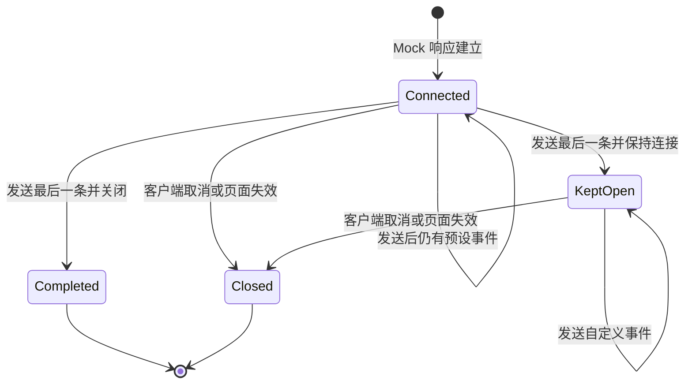
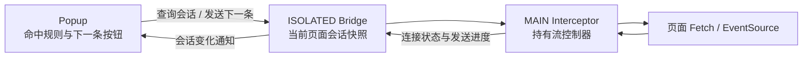

# SSE 手动单步调试方案

本文定义 SSE Mock 的手动单步发送能力。它保留现有按延迟自动发送模式，并允许开发者在页面建立连接后，从扩展 popup 逐条发送预设事件，用于验证加载状态、流式渲染和状态机迁移。

> **状态：已实施。** 本文同时作为交互约定、跨上下文协议说明和验收基线。

---

## 一、设计结论

规则配置页只负责编辑 SSE 规则，不承担运行时调试：

- “发送方式”可选择“自动发送”或“手动单步”；
- 事件列表用于编辑并保存将要发送的事件；
- 配置页不展示连接状态、发送进度、连接选择器或“下一条”按钮。

运行控制只出现在扩展 popup：

- 当前标签页命中手动 SSE 规则后，该规则变为可展开的手风琴；
- 展开后每个连接占一项，连接数量不在折叠行重复展示；
- 每个连接拥有独立的事件游标和“下一条”按钮；
- 每个连接直接展示下一条事件的事件名、事件 ID、重连间隔和消息正文，用户可以在发送前临时修改；
- 发送中只禁用当前连接，其他连接仍可操作；
- 所有预设事件发送完后，关闭的连接显示“已发完”；保持连接的会话切换为空白自定义事件，可继续发送；
- 手风琴标题负责展开或收起，命中图标点击后跳转规则配置页。

这个方案刻意不增加独立调试面板。用户在页面发起请求，在 popup 点击“下一条”，观察页面响应，操作链路保持最短。

```text
被调试页面                         扩展 popup
┌────────────────────┐            ┌─────────────────────────┐
│ 启动两路 SSE 连接   │  命中规则  │ ▾ 手动 SSE Mock          │
│                    │ ─────────▶ │   14:32:08  0 / 3        │
│ 收到 event 1        │ ◀───────── │   0 / 3         [下一条]│
│                    │            │   [事件名] [ID] [重连 ms] │
│                    │            │   [消息正文]              │
└────────────────────┘            └─────────────────────────┘
```

---

## 二、规则配置

在“响应方式”为“SSE 事件流”时显示“发送方式”：

```text
发送方式
○ 自动发送
● 手动单步
```

共享协议使用 `SseSendMode`：

```ts
/** SSE Mock 的事件发送方式。 */
export enum SseSendMode {
  /** 按每条事件的延迟自动发送。 */
  Auto = 'auto',
  /** 建立连接后等待用户逐条发送。 */
  Manual = 'manual',
}
```

`MockResponseAction.sseSendMode` 为可选字段。未设置时按 `Auto` 处理，兼容已有规则。

| 配置 | 自动发送 | 手动单步 |
|---|---|---|
| `delayMs` | 发送前等待指定时间 | 忽略，点击后立即发送 |
| 发完后关闭 | 支持 | 支持 |
| 发完后保持连接 | 支持 | 支持 |
| 循环发送 | 支持 | 不支持 |
| 动态变量 | 实际发送时解析 | 点击发送时解析 |

切换到手动模式时，如果结束行为为“循环发送”，配置页自动切换为“发完后关闭”，并隐藏循环选项。

配置导出协议为 `schemaVersion: 3`。新版导入器继续接受 v2，并把未设置 `sseSendMode` 的 SSE 规则迁移为自动发送。

---

## 三、popup 交互

### 3.1 出现条件

单步按钮需要同时满足：

1. 规则已被 popup 所属的当前标签页命中；
2. 全局开关、分组和规则当前都处于启用状态；
3. 规则包含 SSE Mock 动作；
4. 该动作的发送方式为“手动单步”。

自动 SSE、未命中规则和其他 Mock 规则不显示该按钮。

### 3.2 连接手风琴

popup 只列出所属当前标签页、当前规则的连接。连接列表默认收起，展开后按最新建立优先展示；折叠行不额外显示连接数量，减少与命中图标、通道标签并列时的视觉噪音：

```text
▾ GET /api/manual-sse 手动单步 Mock

  14:32:15               已发送 0 / 3  [下一条]
  [事件名]          [事件 ID]          [重连 ms]
  ┌─────────────────────────────────────────┐
  │ {"step":1,"state":"connected"}         │
  └─────────────────────────────────────────┘

  14:32:08               已发送 1 / 3  [下一条]
  [事件名]          [事件 ID]          [重连 ms]
  ┌─────────────────────────────────────────┐
  │ {"step":2,"state":"processing"}        │
  └─────────────────────────────────────────┘
```

连接卡片不重复展示 URL 和客户端类型，只以建立时间区分；第一行左侧显示时间、右侧显示发送进度。

活动连接和正常完成的连接保留展示，已断开连接隐藏。每个连接独立维护事件游标，不存在隐式的“最近连接”发送行为。

### 3.3 事件来源

“下一条”发送规则中**已保存**的事件，不读取规则编辑器尚未保存的草稿。popup 根据该连接的 `nextEventIndex` 取得对应事件，并把事件、预期下标、事件总数和结束行为一起发送给页面运行时。

“下一条”位于连接卡片第一行发送进度右侧。其下先展示待发送事件的 `event`、`id` 和 `retry` 输入框，再展示 `data` 输入框。用户可以修改任意字段后发送；修改只作用于当前连接、当前事件的本次发送，不回写规则配置，动态变量仍在发送时解析。

如果结束行为为“保持连接”，预设事件全部发送后进度停在 `N / N`，输入区切换为空白自定义事件，按钮文案改为“发送”。用户可以反复编辑并发送自定义事件；发送成功后仍停留在保持连接状态，不推进预设事件游标，也不改变规则中的事件总数。

如果调试过程中修改事件，需要先保存规则，再重新建立连接，避免配置版本与活动连接游标产生歧义。

### 3.4 按钮状态

| 文案 | 状态 | 行为 |
|---|---|---|
| 等待连接 | 规则已命中，但当前没有可展示连接 | 连接列表空状态 |
| 下一条 | 当前连接有待发送事件 | 点击发送一条 |
| 发送 | 预设事件已发完且连接保持打开 | 发送当前临时自定义事件，可重复操作 |
| 发送中 | 命令正在执行 | 禁用 |
| 已发完 | 所有事件已发送且响应流已关闭 | 禁用 |
| 重试 | 会话快照读取失败 | 点击重新读取 |

会话读取失败不会伪装成“等待连接”。发送命令失败时，按钮保留在当前规则上并显示失败提示；popup 同时重新拉取会话快照，避免继续使用失效连接。

---

## 四、运行时模型

每个命中的手动 SSE 请求创建独立会话：



| 状态 | 含义 |
|---|---|
| `connected` | 已建立响应，等待 popup 操作 |
| `completed` | 事件全部发送，响应流已正常结束 |
| `kept-open` | 预设事件全部发送，响应流保持打开，可继续发送临时自定义事件 |
| `closed` | 客户端取消、页面失效或规则变更 |

活动会话属于当前页面生命周期，不写入规则配置，也不经过 background 持久化。MAIN world 持有流控制器，bridge 只保存当前页面可序列化的轻量快照；popup 打开时直接查询当前活动标签页。

---

## 五、跨上下文通信

真正的 `ReadableStreamDefaultController` 和 Mock `EventSource` 位于 MAIN world，因此流控制器保留在页面运行时。popup 只发送命令，不直接持有流对象。



核心消息如下：

| 方向 | 消息 | 作用 |
|---|---|---|
| MAIN → bridge | `PAGE_PORT_MSG_SSE_SESSION_OPENED` | 上报新连接 |
| MAIN → bridge | `PAGE_PORT_MSG_SSE_SESSION_UPDATED` | 上报游标或状态变化 |
| bridge → MAIN | `PAGE_PORT_MSG_SSE_SEND_NEXT` | 携带下一条预设事件或保持连接后的自定义事件并发送 |
| MAIN → bridge | `PAGE_PORT_MSG_SSE_COMMAND_RESULT` | 返回命令结果 |
| popup → 当前标签页 bridge | `RUNTIME_MSG_LIST_SSE_SESSIONS` | 查询当前页面会话快照 |
| popup → 当前标签页 bridge | `RUNTIME_MSG_SSE_SEND_NEXT` | 发送单步命令 |
| bridge → popup | `RUNTIME_MSG_SSE_SESSION_CHANGED` | 通知当前页面会话变化 |

popup 使用 `tabs.sendMessage` 把命令限定到当前标签页的顶层 bridge；命令还需要匹配 `sessionId` 和预期事件下标，并通过 `kind` 区分预设事件与保持连接后的自定义事件。页面导航会销毁旧 bridge 和 MAIN world，因此旧会话不会被带到新页面。预设事件必须推进游标；自定义事件只允许在 `kept-open` 状态发送，并保持 `N / N` 进度不变。

---

## 六、流行为

### Fetch

手动模式创建 `ReadableStream` 后保留 controller，不启动自动发送循环。收到“下一条”命令后：

1. 校验会话、预期事件下标和事件内容；
2. 解析动态变量；
3. 编码一个完整 SSE 数据块；
4. 调用 `controller.enqueue`；
5. 更新游标和会话状态；
6. 最后一条发送后执行关闭或保持连接行为；保持连接时允许继续发送自定义事件。

客户端取消读取时，通过流的 `cancel` 回调释放会话。

### EventSource

手动模式异步派发 `open`，随后停在第一条事件之前。每次命令复用现有单事件派发逻辑，并更新独立游标。调用 `EventSource.close()`、页面卸载或规则失效时释放会话。

### 规则更新

bridge 会把已保存配置推送到 MAIN world。规则被禁用、删除、切换为非 SSE 或改回自动发送时，相关活动手动会话正常关闭并上报最终状态。

---

## 七、范围与限制

第一版不支持：

- 在规则配置页执行运行时控制；
- 在 popup 中选择多个活动连接；
- 任意跳过、回退、重复发送或广播事件；
- 手动模式下循环发送；
- 从未保存的规则草稿直接发送；
- 模拟底层网络错误或半包；
- XHR 流式 SSE Mock。

页面补丁当前只运行在顶层文档，不额外扩展到 iframe。

---

## 八、安全与资源释放

- 只接受通过现有私有 `MessagePort` 到达 MAIN world 的控制命令；
- bridge 只接受当前扩展页面发出的已知控制消息类型；
- popup 使用浏览器标签消息 API 把查询和命令限定到当前活动标签页的顶层 frame；
- 每个页面限制可登记的活动 SSE 会话数量；
- 会话结束后释放流 controller、事件回调和规则对象引用；
- 页面导航、标签页关闭、全局开关关闭或规则失效时清理对应会话；
- SSE 正文始终按文本处理，不解析或执行其中的 HTML。

---

## 九、验证与验收

### 自动化验证

1. 未设置发送方式的旧规则仍按自动模式执行。
2. 手动 Fetch 响应在收到命令前不产生数据块。
3. 每次命令只产生一个完整 SSE 数据块，且忽略 `delayMs`。
4. 动态变量在发送时解析。
5. 最后一条事件正确执行关闭或保持连接行为，保持连接后可以重复发送自定义事件且预设进度不变。
6. 多个运行时会话的游标互不影响。
7. 重复命令、过期会话和已关闭会话不会重复发送。
8. 客户端取消、页面卸载和规则删除后正确释放会话。
9. Mock EventSource 的 `open`、`message`、自定义事件和 `close()` 行为不回归。
10. popup 只为当前标签页命中的手动 SSE 规则生成连接手风琴，每个连接可以独立发送。

### 手动验收

1. 导入 `fixtures/request-lab/req-freedom-config.json`。
2. 打开 `http://127.0.0.1:4317/`，启动 Fetch 流或 EventSource。
3. 同时启动 Fetch 流和 EventSource，打开扩展 popup，确认展开后显示两个连接。
4. 展开规则，确认每个连接第一行显示时间、进度与“下一条”，下方显示可编辑的事件名、事件 ID、重连间隔与消息正文。
5. 修改其中一个连接的消息并分别点击“下一条”，确认 request-lab 收到修改内容且两个接收时间独立更新。
6. 验证最后一条发送后，关闭型连接显示“已发完”；保持型连接显示 `N / N` 与“发送”，并可继续发送自定义事件。
7. 刷新页面或停止客户端，确认旧连接从列表隐藏且不再可发送。

跨包改动完成后运行根目录类型检查与构建；调整导出时运行 `pnpm knip`。所有命令通过 `mise exec -- ...` 使用项目指定工具链。
